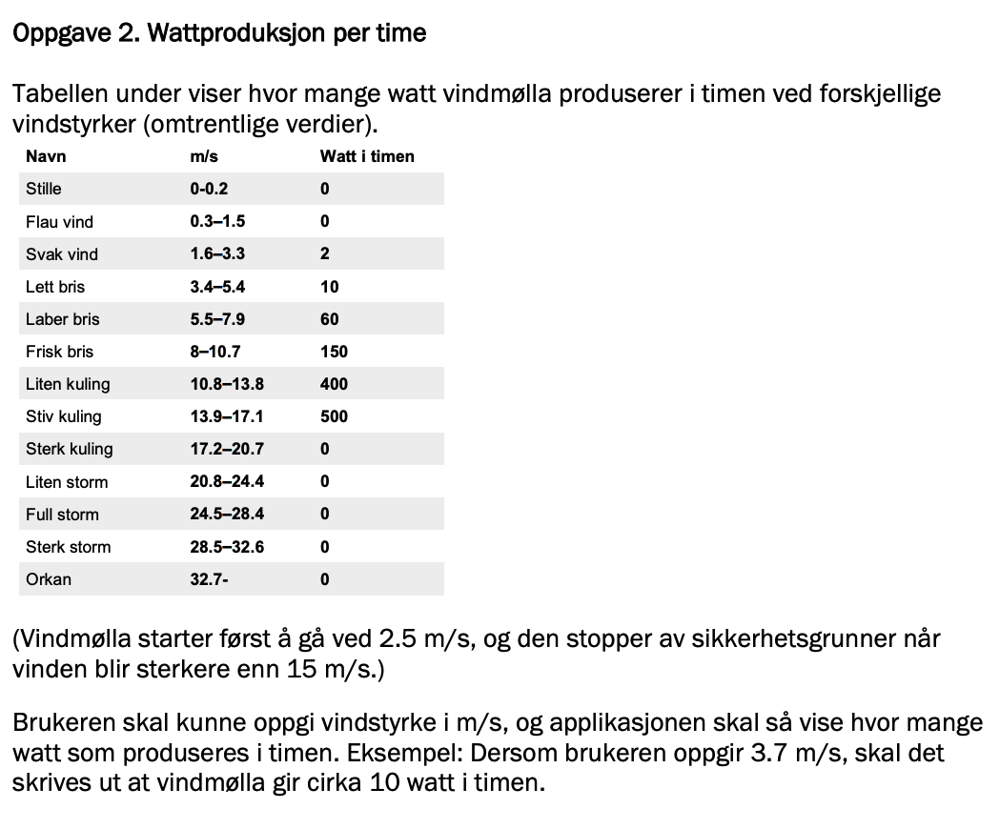
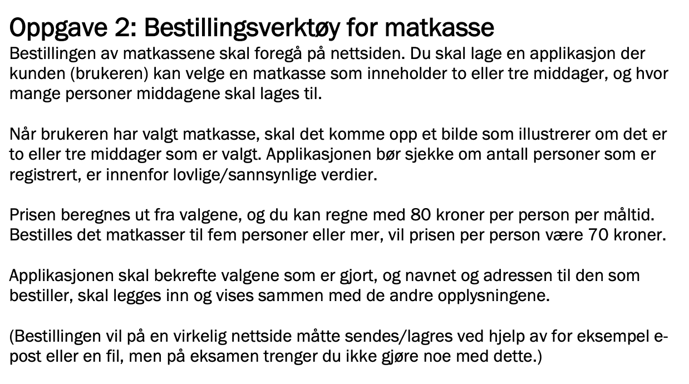
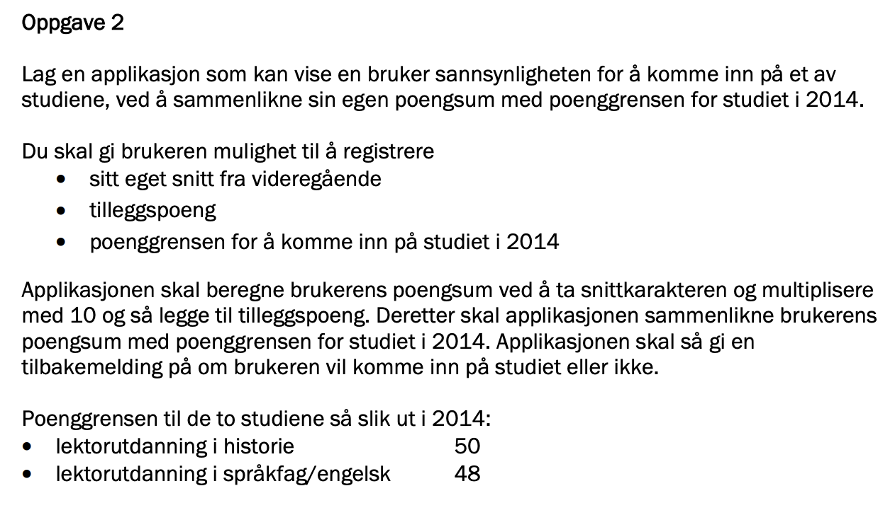
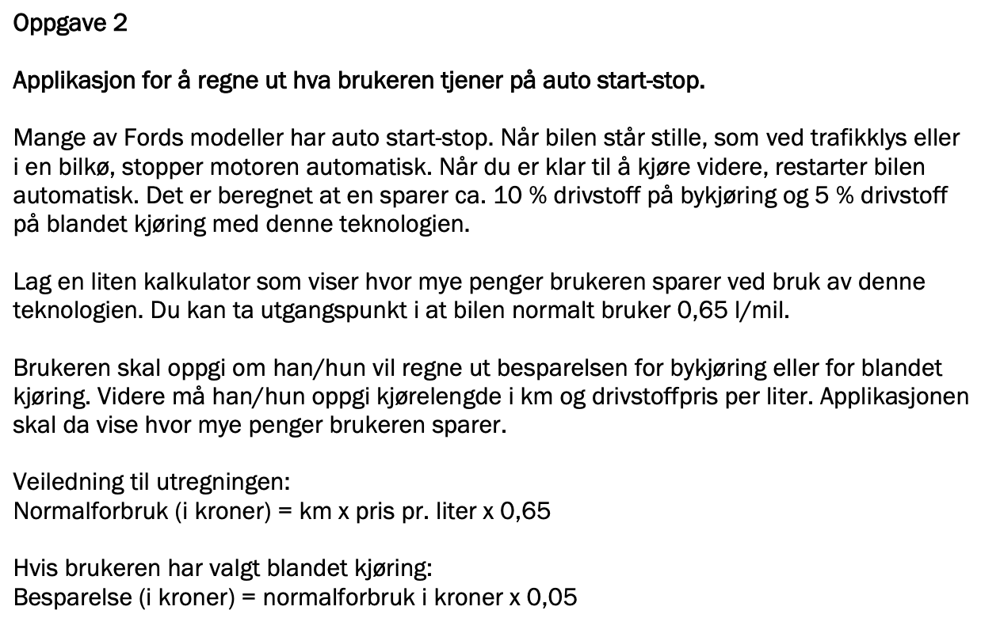
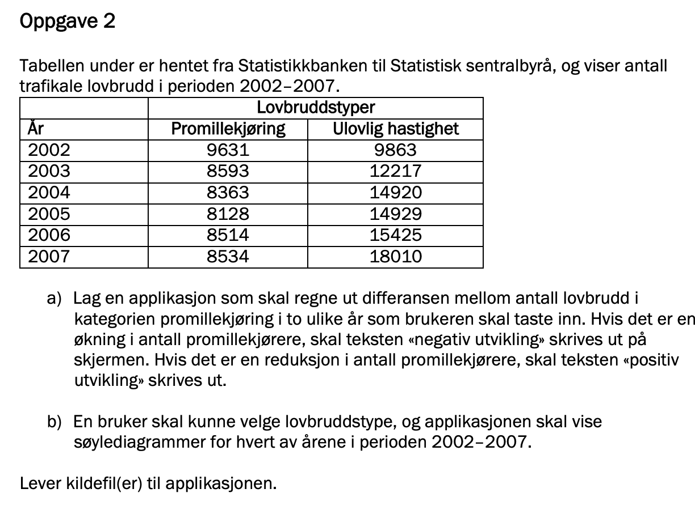

# Eksamensoppgaver

Tidligere eksamener i IT2 består som regel av fire oppgaver, med følgende oppsett:

- Oppgave 1 er en multimediaoppgave, dvs. en animasjon, et slideshow, film eller lignende. 
- **Oppgave 2 er noe som ligner en kalkulator** (i dag)
- Oppgave 3 er en større applikasjon av noe slag
- Oppgave 4 er planlegging og dokumentasjon


Eksamensoppgaver finner du her: <http://it2cha.com/eksamen2.html>


## Typiske oppgave2-oppgaver

**Må kunne:**

- HTML og CSS
  - Tekst, overskrift
  - Input-elementer: <https://www.w3schools.com/html/html_form_input_types.asp>
  - Knapper
- Javascript
  - Enkle variabler og datatyper
  - Hente ut verdier fra input-elementene, eks: `let vindstyrke = inpStyrke.value;`
  - Hendelsesfunksjoner, eks: `knapp.onclick = kalkulatorfunksjon;`
  - If-setninger
  - Skrive HTML med javascript, eks: ```resultat.innerHTML = `<div>${vindtype}</div>` ```
  - Endre HTML-attributter med javascript, eks: `bilde.src = "gratisMat.png";`
  - Endre style (CSS) med javascript, eks: `resultat.style.color = "red";`


### Våren 2017




### Høsten 2016




### Høsten 2015




### Høsten 2014




### Våren 2014

